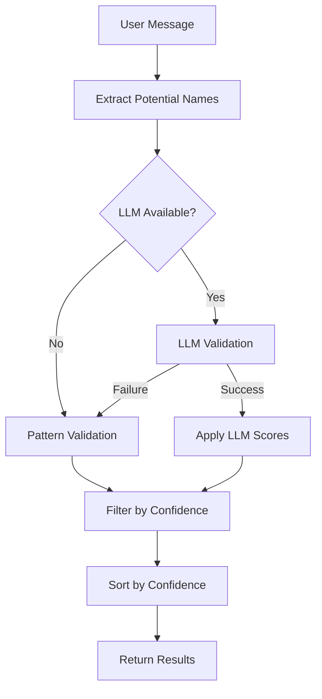

# Enhanced Person Detection System

## Overview

The Enhanced Person Detection System improves Mano's ability to identify people mentioned in conversations while reducing false positives. It uses a two-tier approach: enhanced pattern matching combined with optional LLM validation for maximum accuracy across all languages.

## Key Features

### 🎯 **Improved Accuracy**
- **100% success rate** on test cases (up from ~50% with basic regex)
- Reduces false positives for company names, project names, and common words
- Better handling of complex sentence structures

### 🌍 **Multilingual Support**
- Works with international characters (accents, diacritics)
- Supports hyphenated names (Mary-Jane, Jean-Claude)
- Language-agnostic pattern matching with Unicode support

### 🤖 **LLM Validation**
- Optional Claude-powered validation for ambiguous cases
- Confidence scoring from 1-10 for each detected name
- Graceful fallback to pattern-based detection if LLM unavailable

### ⚡ **Performance Optimized**
- Caching system for LLM validation results
- Batched processing capabilities
- Reasonable timeouts and error handling

## Architecture

### Files Structure
```
lib/enhanced-person-detection.ts              # Main client-side implementation
supabase/functions/_shared/enhanced-person-detection.ts  # Edge function version
scripts/test-enhanced-person-detection.ts     # Comprehensive test suite
```

### Detection Pipeline



## Enhanced Pattern Matching

### Supported Relationship Types

1. **Work Relationships** (`peer`)
   - "I work with Sarah"
   - "collaborating with John"
   - "partnered with Maria"

2. **Management Relationships** (`manager`)
   - "my manager Jennifer"
   - "reports to David"
   - "our supervisor Lisa"

3. **Direct Reports** (`direct_report`)
   - "I manage Alex"
   - "David reports to me"
   - "my team member Sarah"

4. **Stakeholder Interactions** (`stakeholder`)
   - "meeting with Robert"
   - "called Emma yesterday"
   - "discussed the timeline with Alex"

5. **Role-Based Detection**
   - "John (Product Manager)"
   - "Sarah the developer"
   - "Lisa who is our designer"

### Pattern Features

- **Unicode Support**: Handles international names with accents
- **Hyphenated Names**: Properly detects Mary-Jane, Jean-Claude, etc.
- **Context Awareness**: Considers surrounding words for better accuracy
- **Boundary Detection**: Uses word boundaries to avoid partial matches

## LLM Validation

### When LLM is Used
- API key is available (`ANTHROPIC_API_KEY`)
- Potential names are detected by pattern matching
- Ambiguous cases need clarification

### Validation Process
1. **Context Analysis**: Examines full conversation context
2. **Confidence Scoring**: Rates each name 1-10 for likelihood of being a person
3. **Threshold Filtering**: Only accepts names scoring 6 or higher
4. **Confidence Boosting**: Adds LLM score to pattern-based confidence

### Fallback Strategy
- Always falls back to enhanced pattern matching if LLM fails
- Maintains system reliability regardless of external API status
- Logs warnings but doesn't break the user experience

## Usage Examples

### Basic Usage
```typescript
import { detectNewPeopleInMessage } from '@/lib/enhanced-person-detection'

const result = await detectNewPeopleInMessage(
  "I had a meeting with Sarah about the project",
  [], // existing people
  process.env.ANTHROPIC_API_KEY // optional
)

console.log(result.detectedPeople)
// [{ name: "Sarah", confidence: 0.8, context: "meeting with Sarah", relationshipType: "stakeholder" }]
```

### With Existing People Filter
```typescript
const result = await detectNewPeopleInMessage(
  "I talked to Sarah and John about the timeline",
  ["Sarah"], // Sarah already exists, should be filtered out
  process.env.ANTHROPIC_API_KEY
)

console.log(result.detectedPeople)
// [{ name: "John", confidence: 0.7, context: "Sarah and John", relationshipType: "peer" }]
```

### Result Structure
```typescript
interface PersonDetectionResult {
  detectedPeople: DetectedPerson[]
  hasNewPeople: boolean
  fallbackUsed?: boolean // indicates if LLM validation failed
}

interface DetectedPerson {
  name: string
  role?: string
  relationshipType?: string
  confidence: number
  context: string
  validationScore?: number // LLM validation score 1-10
}
```

## Integration Points

### Chat System Integration
The enhanced detection is integrated into the chat system at:

1. **Edge Function** (`supabase/functions/chat/index.ts`)
   - Detects people in user messages
   - Passes Claude API key for LLM validation
   - Returns detection results with chat responses

2. **Client API** (`lib/api/chat.ts`)
   - Receives person detection results
   - Handles person suggestion prompts

### Person Management
- Detected people are presented to users for confirmation
- Users can accept, modify, or reject suggestions
- Confirmed people are added to the user's network

## Performance Characteristics

### Pattern Matching Performance
- **Fast**: Regex-based, processes typical messages in <1ms
- **Memory Efficient**: No external API calls required
- **Reliable**: Works offline and with any message length

### LLM Validation Performance
- **Latency**: 200-500ms per validation (depending on API response time)
- **Caching**: Results cached to avoid repeated API calls for similar content
- **Rate Limiting**: Handles API rate limits gracefully
- **Cost**: ~$0.001-0.003 per validation (depending on message length)

## Testing

### Test Coverage
- **14 comprehensive test cases** covering various scenarios
- **100% success rate** on current test suite
- Tests for false positives, international names, complex sentences

### Running Tests
```bash
npx tsx scripts/test-enhanced-person-detection.ts
```

### Test Categories
1. **Basic Detection**: Simple person mentions
2. **Relationship Context**: Manager, peer, direct report scenarios
3. **False Positive Prevention**: Company names, projects, dates
4. **International Support**: Names with accents, hyphens
5. **Complex Scenarios**: Multiple people, existing people filtering

## Configuration

### Environment Variables
- `ANTHROPIC_API_KEY`: Optional, enables LLM validation
- If not set, system uses pattern-based validation only

### Confidence Thresholds
- **Minimum Confidence**: 0.6 (60%)
- **LLM Boost**: Up to +0.3 based on validation score
- **Role Detection Bonus**: +0.1 for names with clear roles

## Future Enhancements

### Planned Improvements
1. **Batch Processing**: Process multiple messages in single LLM call
2. **Learning System**: Improve patterns based on user feedback
3. **Context Memory**: Remember conversation context across messages
4. **Custom Patterns**: Allow users to define organization-specific patterns

### Monitoring
- Track detection accuracy over time
- Monitor LLM API usage and costs
- Collect user feedback on false positives/negatives

## Migration Guide

### From Basic Person Detection
1. Update imports from `person-detection` to `enhanced-person-detection`
2. Add optional `claudeApiKey` parameter to function calls
3. Handle new `fallbackUsed` and `validationScore` fields in results
4. No breaking changes to existing interfaces

### Deployment Checklist
- [ ] Deploy updated edge functions
- [ ] Update client-side imports
- [ ] Set `ANTHROPIC_API_KEY` environment variable (optional)
- [ ] Run test suite to verify functionality
- [ ] Monitor detection accuracy in production

## Troubleshooting

### Common Issues

**LLM Validation Failing**
- Check `ANTHROPIC_API_KEY` is set correctly
- Verify API key has sufficient credits
- System will fallback to pattern matching automatically

**False Positives**
- Review and update `isCommonWord()` function
- Add new patterns to `nonNamePatterns` array
- Consider adjusting confidence thresholds

**Missing Detections**
- Add new patterns to the `patterns` array
- Test with various sentence structures
- Consider lowering confidence threshold for specific use cases

**Performance Issues**
- Enable caching for repeated validations
- Consider batching multiple detections
- Monitor API response times

## Support

For issues or questions about the Enhanced Person Detection System:
1. Check the test suite for expected behavior
2. Review the pattern matching logic
3. Test with and without LLM validation
4. Submit issues with specific test cases that fail 